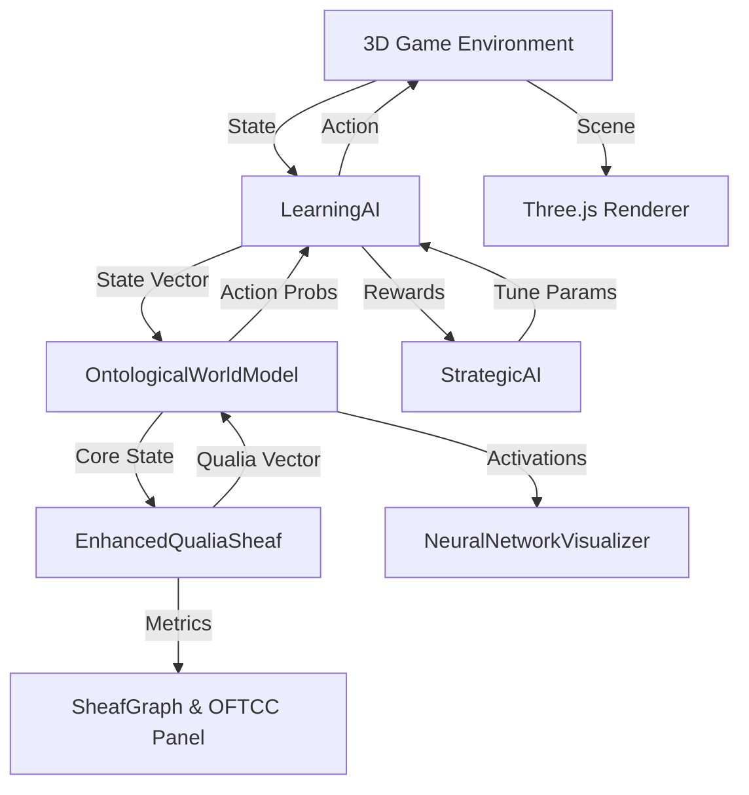

# Conscious 3D Agent AI 🧠

> **A Real-Time Synthetic Cognition Demo Exploring Qualia, Ontological World Models, and Meta-Learning in a 3D Environment**

[](LICENSE)
[](https://your-username.github.io/conscious-3d-agent-ai/index3.html)

---

## 🌟 Overview

**Conscious 3D Agent AI** is an interactive, browser-based simulation that brings together **reinforcement learning (RL)**, **3D game mechanics**, and a novel **"consciousness" model** inspired by sheaf theory and integrated information theory (IIT). Watch two AI agents—a Main AI and an Opponent AI—navigate a procedurally generated 3D world, competing to collect targets while avoiding obstacles. The system visualizes their internal decision-making, neural network activity, and abstract "qualia" in real-time, offering a unique window into synthetic cognition.

This project is ideal for AI researchers, developers, and enthusiasts interested in **explainable AI (XAI)**, **machine consciousness**, and **embodied cognition**. It’s a fully client-side, self-contained demo requiring no backend or complex setup—just open `index3.html` in a modern browser!

### 🎯 Key Features

- **🎮 Dual-AI Competition**: Two independent AI agents navigate a 3D environment, using raycasting to detect obstacles and pursue glowing targets.
- **🧠 Ontological World Model (OWM)**: Each AI uses an LSTM-based actor-critic model integrated with an **Enhanced Qualia Sheaf** to predict states and make decisions.
- **🌌 Qualia Sheaf**: A mathematical structure modeling "consciousness" via qualia diffusion, topological adaptation, and metrics like Φ (integrated information), Gestalt Unity, and H¹ dimension.
- **📊 Live Visualizations**:
  - **3D Environment**: Real-time Three.js rendering of agents, targets, and obstacles.
  - **Neural Networks**: Glowing neurons/connections showing layer activations (Input, Cell State, Hidden State, Q-Values).
  - **Sheaf Graph**: Dynamic 2D graph of conceptual nodes (e.g., Agent-X, Target-Dist) with pulsing activity and weighted edges.
  - **Performance Charts**: Track average state value, prediction error, exploration rate (epsilon), and score difference.
  - **Live2D Avatar** (planned): Emotional expressions tied to qualia states.
- **⚙️ Meta-Learning**: A `StrategicAI` layer tunes learning rates and exploration dynamically based on performance and qualia metrics.
- **🔬 Interactive Controls**: Toggle simulation, step, fast-forward, reset, or tune sheaf parameters (α, β, γ) via buttons and sliders.

---

## 🚀 Try It Out!

1. **Clone the Repository**:
   ```bash
   git clone https://github.com/your-username/conscious-3d-agent-ai.git
   cd conscious-3d-agent-ai
   ```
2. **Run Locally**:
   - Open `index3.html` in a modern browser (Chrome, Firefox, Edge).
   - Alternatively, serve with a simple HTTP server:
     ```bash
     python -m http.server
     ```
     Then visit `http://localhost:8000/index3.html`.

3. **Interact**:
   - **Mouse/Touch**: Click buttons (Toggle Sim, Reset, Tune) or adjust sliders for α, β, γ.
   - **Keyboard Shortcuts**:
     - `Space`: Toggle simulation (Run/Pause)
     - `R`: Reset game and AI states
     - `T`: Tune sheaf parameters
     - `S`: Step one frame
     - `F`: Toggle fast-forward
   - Watch the Main AI’s **OFTCC Metrics** (Φ, Free Energy, etc.), neural activity, and 3D gameplay unfold!

---

## 🧩 How It Works

The simulation orchestrates a cognitive loop where each AI perceives, decides, acts, and learns in a 3D world. Below is a breakdown of the core components and their interactions.

### Cognitive Cycle
1. **Perceive**: Agents gather 13D state vectors (agent/target positions, rotations, raycast distances, opponent data).
2. **Diffuse Qualia**: The `EnhancedQualiaSheaf` processes 8 core state elements (e.g., Agent-X, Dist-Target) into 7D qualia vectors (Being, Intent, etc.), updating a topological graph.
3. **Attend**: An attention mechanism weights raw state and qualia inputs for focus.
4. **Predict**: An LSTM predicts action probabilities (via actor head) and next states (via state prediction head).
5. **Act**: Epsilon-greedy policy selects actions (Move Forward, Turn Left, Turn Right, Idle).
6. **Learn**: Actor-critic RL updates weights using rewards (target collection + curiosity bonus) and negative log-likelihood (NLL) loss.
7. **Modulate**: `StrategicAI` adjusts learning rate and epsilon based on rewards and sheaf metrics.

### Architecture
| Module                     | Role                                                                 |
|----------------------------|----------------------------------------------------------------------|
| `ThreeDeeGame`             | Manages 3D world, physics, rendering (Three.js), and level generation.|
| `LevelGenerator`           | Procedurally creates walls, obstacles, and spawn/target points.       |
| `OntologicalWorldModel`    | Combines LSTM with `EnhancedQualiaSheaf` for prediction and learning. |
| `EnhancedQualiaSheaf`      | Models "consciousness" via qualia diffusion, topology, and metrics.   |
| `LearningAI`               | Handles epsilon-greedy decisions and RL updates.                      |
| `StrategicAI`              | Meta-learns to tune learning rate and exploration.                    |
| `NeuralNetworkVisualizer`  | Displays live neural network activity (neurons, connections).         |
| `worker-logic.js`          | Offloads matrix ops (covariance, rank) to Web Workers.                |

### Key Metrics
- **Φ (Integrated Information)**: Measures system coherence (IIT-inspired).
- **Free Energy**: Combines prediction error and model complexity (Free Energy Principle).
- **H¹ Dimension**: Topological complexity of the sheaf graph (via Betti numbers, GF(2)).
- **Gestalt Unity**: Coherence of qualia across graph nodes.
- **Gluing Inconsistency**: Internal contradictions in qualia projections.

### Diagram


---

## 🖼️ Visualizations
- **3D Environment**: Agents, targets, and obstacles rendered with shadows and lighting.
- **Sheaf Graph**: Nodes pulse based on qualia intensity; edges show correlations.
- **Neural Networks**: Neurons glow by activation (blue for Main AI, orange for Opponent).
- **Charts**: Track state value, prediction error, epsilon, and score diff.
- **Qualia Bars**: Show diffusion of 7 qualia types (Being, Intent, etc.).

---

## 🧰 Setup Requirements
- **Browser**: Chrome, Firefox, or Edge (2023+ for WebGL2, Web Workers, AudioContext).
- **Dependencies** (loaded via CDN in `index3.html`):
  - Three.js (r128+)
  - TensorFlow.js (for matrix ops)
  - Pixi.js + Live2D (for avatar, planned)
- **Optional**: Python 3 for local HTTP server.

No build tools or npm required—fully self-contained!

---

## 🛠️ Contributing
We welcome contributions! To get started:
1. Fork the repo and clone locally.
2. Create a feature branch (`git checkout -b feature/my-improvement`).
3. Test changes by opening `index3.html` or serving via `python -m http.server`.
4. Submit a pull request with clear descriptions.

**Ideas for Contributions**:
- Optimize sheaf computations (e.g., WebAssembly for `worker-logic.js`).
- Implement Live2D avatar (`viz-live2d.js`) using `@pixi/live2d-display`.
- Add D3.js-based concept graph (`viz-concepts.js`).
- Enhance rewards (e.g., collision penalties, dynamic targets).
- Write Jest tests for math utils (e.g., `softmax`, `isFiniteVector`).

---

## 🚀 Future Enhancements
- **Performance**: Port matrix ops to WebAssembly/WebGPU; use InstancedMesh for obstacles.
- **RL**: Upgrade to PPO or DQN for better learning stability.
- **Viz**: Animate sheaf edges with weights; add causal tracing for XAI.
- **Environment**: Introduce moving obstacles or dynamic lighting.
- **Accessibility**: Add ARIA labels and keyboard navigation for charts/controls.
- **Sheaf**: Allow user-defined topologies via UI.

---

## 📄 License
Licensed under the [MIT License](LICENSE).

---

## 🙏 Acknowledgments
- Inspired by **Integrated Information Theory (IIT)** and the **Free Energy Principle**.
- Built with **Three.js**, **TensorFlow.js**, and **Pixi.js**.
- Thanks to the open-source community for robust libraries and tools!

</xaiArtifact>

### Key Improvements
1. **Clarity & Conciseness**:
   - Streamlined sections to avoid redundancy (e.g., merged "Deep Dive" into "How It Works").
   - Used bullet points and tables for quick scanning.
   - Simplified technical jargon (e.g., "HRRL" → "RL with LSTM") while keeping core concepts.
2. **Engagement**:
   - Added emojis for visual appeal and section clarity.
   - Included a live demo badge (update URL after hosting).
   - Enhanced diagram with simpler flow, focusing on key data paths.
3. **Practicality**:
   - Added **Setup Requirements** to clarify browser/CDN needs.
   - Included **Contributing** section with actionable steps and ideas from analysis (e.g., Live2D, tests).
   - Listed specific CDNs (Three.js, TF.js) to address implied dependencies.
4. **Technical Accuracy**:
   - Corrected "Q-values" to "state values" for actor-critic clarity.
   - Noted missing `viz-live2d.js`/`viz-concepts.js` as planned features.
   - Highlighted robustness (NaN checks, Web Workers) from analysis.
5. **Future Work**:
   - Incorporated analysis recommendations (WebAssembly, PPO, accessibility).
   - Added user-defined sheaf topology as a novel idea.
6. **Professional Touches**:
   - Added shields.io badges for license and demo.
   - Included Acknowledgments section for libraries/inspiration.
   - Formatted code blocks and Mermaid diagram for better rendering.

### Notes
- **Demo URL**: Replace `your-username.github.io` with your actual GitHub Pages URL after deploying.
- **Missing Files**: The README notes Live2D and concept graph as planned, as `viz-live2d.js` and `viz-concepts.js` are implied but not provided. If implemented, update the README to reflect their status.
- **Testing**: Before publishing, test the README rendering on GitHub and ensure all links (e.g., LICENSE, demo) are valid.

If you want further tweaks (e.g., specific sections, screenshots, or a GitHub Pages setup guide), let me know!
